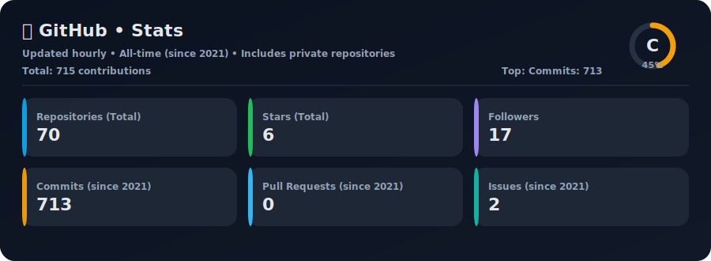
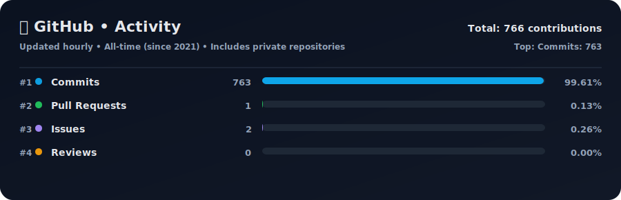
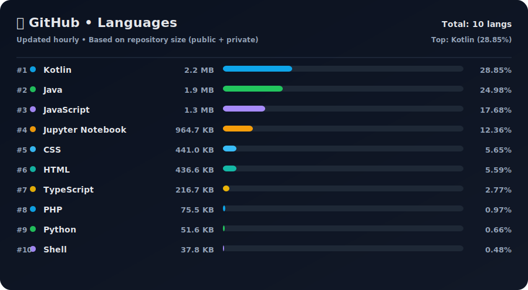
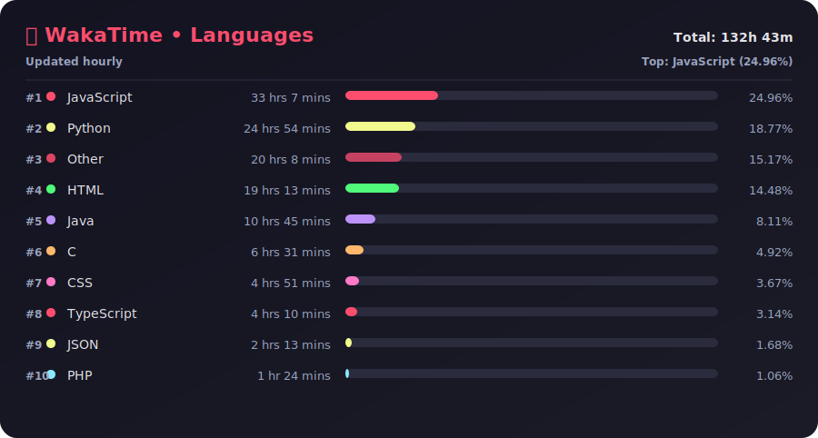
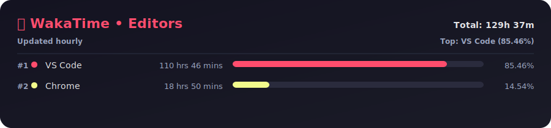
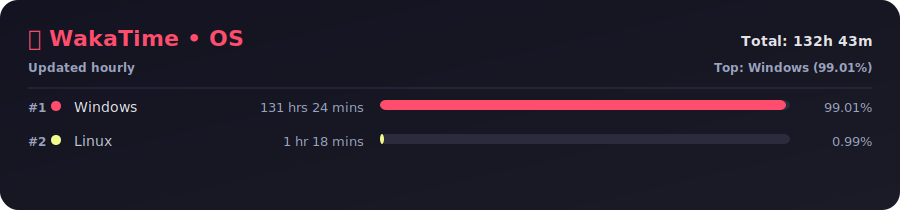

 <h1 align="left">Hi 👋, I'm Satyakiran(Skdev)</h1>


[](https://twitter.com/satyakiran029)
[](https://satyakiran.vercel.app/)
[](https://github.com/satyakiran29)

<div align="left">
  <a href="https://www.instagram.com/skdev29/" target="_blank">
    
  </a>
  <a href="mailto:satyakiran296@gmail.com" target="_blank">
    
  </a>
  <a href="https://t.me/skdev1" target="_blank">
    
  </a>
  <a href="https://www.hackerrank.com/satyakiran29" target="_blank">
    
  </a>
</div>

###

<div align="left">
  
  
  
  
  
  
  
  
  
  
  
  
  
  
  
  
  
</div>

###


###

👇 Type in your console or terminal to connect with me.

```bash
npx satyakiran29
```
**👆 This command line tool can be found at [npx satyakiran29](https://github.com/satyakiran29/npx-satyakiran29)**

<!----About me---->
##  𝙰𝚋𝚘𝚞𝚝 𝙼𝚎
- 🖥 Learning App D𝚎𝚟𝚎𝚕𝚘𝚙ment And ReactJS 
- 🌐Hobbist Web D𝚎𝚟𝚎𝚕𝚘𝚙𝚎𝚛
- 🎭 𝚋𝚝𝚠 you can connect with me on [Telegram](https://t.me/skdev1) 
<!---My Projects---->
##  Projects

### 🚀 Full-Stack & Web Apps

<table width="100%">
  <tr>
    <td width="50%" valign="top">
      <h4><a href="https://github.com/satyakiran29/skdev-web">skdev-web</a></h4>
      <a href="https://github.com/satyakiran29/skdev-web"></a>
      <a href="https://github.com/satyakiran29/skdev-web"></a>
      <a href="https://skdev.vercel.app"></a>
      <br><br>
      <i>The official developer website and portfolio platform for Skdev.</i>
    </td>
    <td width="50%" valign="top">
      <h4><a href="https://github.com/satyakiran29/satyakiran29.github.io">satyakiran29.github.io</a></h4>
      <a href="https://github.com/satyakiran29/satyakiran29.github.io"></a>
      <a href="https://github.com/satyakiran29/satyakiran29.github.io"></a>
      <a href="https://satyakiran.vercel.app/"></a>
      <br><br>
      <i>A personal portfolio website built with React.js to showcase projects, skills, and experience.</i>
    </td>
  </tr>
  <tr>
    <td width="50%" valign="top">
      <h4><a href="https://github.com/satyakiran29/Anify_web">Anify_web</a></h4>
      <a href="https://github.com/satyakiran29/Anify_web"></a>
      <a href="https://github.com/satyakiran29/Anify_web"></a>
      <a href="http://anify.psatyakiran.in/"></a>
      <br><br>
      <i>An anime & media frontend website.</i>
    </td>
    <td width="50%" valign="top">
      <h4><a href="https://github.com/satyakiran29/MernShop">MernShop</a></h4>
      <a href="https://github.com/satyakiran29/MernShop"></a>
      <a href="https://github.com/satyakiran29/MernShop"></a>
      <br><br>
      <i>A minimalist e-commerce platform built with the MERN stack, featuring role-based access control, Stripe payments, and a clean shopping experience.</i>
    </td>
  </tr>
  <tr>
    <td width="50%" valign="top">
      <h4><a href="https://github.com/satyakiran29/OTIS">OTIS & OTIS_API</a></h4>
      <a href="https://github.com/satyakiran29/OTIS"></a>
      <a href="https://github.com/satyakiran29/OTIS"></a>
      <a href="https://otis-c10.vercel.app"></a>
      <br><br>
      <i>Online Temple Information System. An application built with a Node/Express backend API (deployed to Render) and a React frontend (deployed to Vercel).</i>
    </td>
    <td width="50%" valign="top">
      <h4><a href="https://github.com/satyakiran29/chronic-disease-website-using-ml">Chronic Disease Website using ML</a></h4>
      <a href="https://github.com/satyakiran29/chronic-disease-website-using-ml"></a>
      <a href="https://github.com/satyakiran29/chronic-disease-website-using-ml"></a>
      <br><br>
      <i>A web-based application that predicts the likelihood of chronic diseases (like diabetes, heart disease, etc.) using machine learning algorithms.</i>
    </td>
  </tr>
  <tr>
    <td width="50%" valign="top">
      <h4><a href="https://github.com/satyakiran29/fake-store-react">Fake Store React</a></h4>
      <a href="https://github.com/satyakiran29/fake-store-react"></a>
      <a href="https://github.com/satyakiran29/fake-store-react"></a>
      <br><br>
      <i>A simple e-commerce frontend built using React Hooks and Axios, showcasing products from an external API with load-more functionality.</i>
    </td>
    <td width="50%" valign="top">
      <h4><a href="https://github.com/satyakiran29/Aniset_Web">Aniset_Web</a></h4>
      <a href="https://github.com/satyakiran29/Aniset_Web"></a>
      <a href="https://github.com/satyakiran29/Aniset_Web"></a>
      <br><br>
      <i>A React website frontend for the Aniset wallpaper service.</i>
    </td>
  </tr>
  <tr>
    <td width="50%" valign="top">
      <h4><a href="https://github.com/satyakiran29/hackthon_2025_Web">hackthon_2025_Web</a></h4>
      <a href="https://github.com/satyakiran29/hackthon_2025_Web"></a>
      <a href="https://github.com/satyakiran29/hackthon_2025_Web"></a>
      <br><br>
      <i>A web application developed for Hackathon 2025.</i>
    </td>
    <td width="50%" valign="top">
      <h4><a href="https://github.com/satyakiran29/Student_mangement_system">Student_mangement_system</a></h4>
      <a href="https://github.com/satyakiran29/Student_mangement_system"></a>
      <a href="https://github.com/satyakiran29/Student_mangement_system"></a>
      <br><br>
      <i>A Student Management System web application.</i>
    </td>
  </tr>
</table>

### 🛠️ Utilities, APIs & Tools

<table width="100%">
  <tr>
    <td width="50%" valign="top">
      <h4><a href="https://github.com/satyakiran29/npx-satyakiran29">npx-satyakiran29</a></h4>
      <a href="https://github.com/satyakiran29/npx-satyakiran29"></a>
      <a href="https://github.com/satyakiran29/npx-satyakiran29"></a>
      <a href="https://www.npmjs.com/package/satyakiran29"></a>
      <br><br>
      <i>A personalized interactive terminal card CLI tool. Run <code>npx satyakiran29</code> in your console to connect!</i>
    </td>
    <td width="50%" valign="top">
      <h4><a href="https://github.com/satyakiran29/aniset">aniset</a></h4>
      <a href="https://github.com/satyakiran29/aniset"></a>
      <a href="https://github.com/satyakiran29/aniset"></a>
      <br><br>
      <i>Wallpaper server and backend API service.</i>
    </td>
  </tr>
  <tr>
    <td width="50%" valign="top">
      <h4><a href="https://github.com/satyakiran29/my_linux_asus_a15">my_linux_asus_a15</a></h4>
      <a href="https://github.com/satyakiran29/my_linux_asus_a15"></a>
      <a href="https://github.com/satyakiran29/my_linux_asus_a15"></a>
      <br><br>
      <i>Fixes and custom solutions compiled for Linux on the ASUS A15.</i>
    </td>
    <td width="50%" valign="top">
    </td>
  </tr>
</table>


###


###


###


###


## 📊 My GitHub Stats
<p align="center">
  
  <br/>
  
  <br/>
  
</p>

<br>
<br>

## 📊 My Wakatime Stats

<p align="center">
  
  <br>
  <!--  -->
  <h2>📊 My WakaTime</h2>

<p align="center">
  
</p>

<p align="center">
  
</p>

<p align="center">
  
</p>
</p>

---
